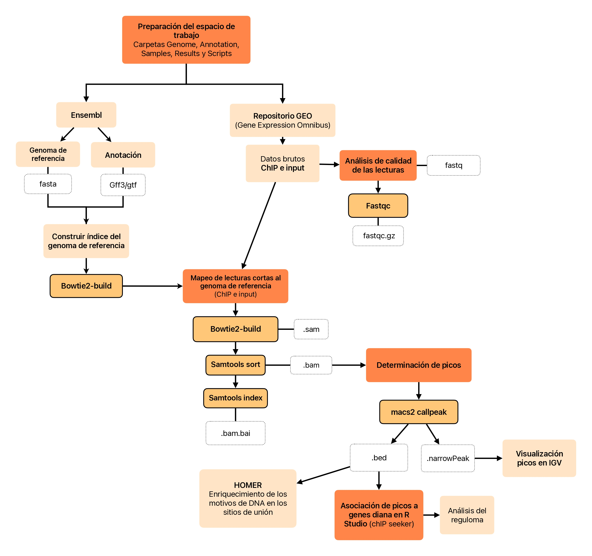
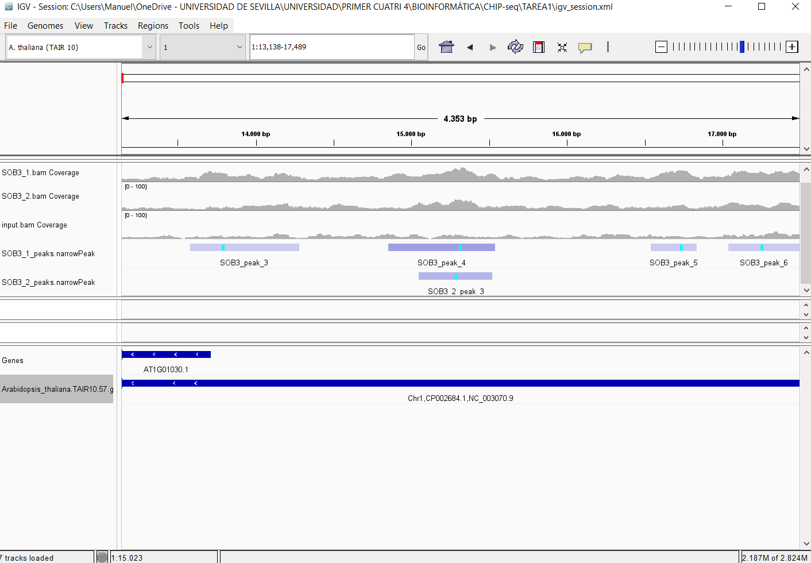

---
output:
  word_document: default
  html_document: default
  pdf_document: default
---

https://github.com/manuar02/BAG2023_2.git


# Tarea 1: Análisis de datos cistrómicos
#### Autores: Andrés Méndez Hurtado, Lucía De Los Santos Carrascal, Gloria Álvarez Alegre, Pablo Rafael Pombero Hurtado, Manuel Anglada Reina 

## Introducción

Cuando las plantas detectan estrés suelen reducir su crecimiento para preservar recursos y orientarlos hacia los mecanismos de respuesta a este. En el caso de *Arabidopsis thaliana*, se ha sugerido que la familia de factores de transcripción nuclear con motivo **AT-hook (AHL)** está involucrada en limitar el crecimiento de las rosetas como respuesta al estrés. Sin embargo, este mecanismo era desconocido. Aquí, se establece que el factor **SUPPRESSOR OF PHYTOCHROME B4-#3 (SOB3)** y otros AHL restringen la elongación de los pecíolos, los cuales desempeñan un papel esencial en la adaptabilidad al entorno, al actuar como antagonistas a los **PHYTOCHROME-INTERACTING FACTORs (PIFs)**, que promueven el crecimiento. Se observa que altos niveles de expresión de **SOB3** generan un fenotipo de pecíolos cortos, similar a la eliminación de **PIF4**, mientras que la mutación dominante negativa **sob3-6** resulta en pecíolos largos, dependientes de la presencia de **PIFs**. Además, se demuestra que los AHL reprimen la expresión de numerosos genes activados por **PIFs**, varios de los cuales están relacionados con la promoción del crecimiento mediado por hormonas. En conjunto, estos resultados evidencian que los **AHL** reprimen el crecimiento de los pecíolos al interferir en la activación transcripcional mediada por **PIFs** de genes asociados con el crecimiento y las vías hormonales.

### Antecedentes

En el contexto de este artículo, los antecedentes que motivaron la realización del análisis de ChIP-seq para el factor de transcripción **SOB3** se basan en investigaciones previas que habían identificado la familia de factores de transcripción nuclear con motivo **AT-hook (AHL)** como componentes clave en la respuesta de las plantas al estrés y en la regulación del crecimiento y desarrollo. Investigaciones anteriores habían demostrado que los **AHLs** tienen un papel importante en la respuesta de las plantas al estrés y en la modulación del crecimiento. Además, se había revelado que los **AHLs** influyen en una gran variedad de procesos fisiológicos en plantas, como el crecimiento del hipocótilo, la transición floral, el desarrollo de inflorescencias y flores, la senescencia y la inmunidad. Asimismo, se había observado que la expresión de genes **AHL** está influenciada por diversos tipos de estrés. Sin embargo, a pesar de estas observaciones, el mecanismo exacto por el cual los AHLs afectan al crecimiento y responden al estrés aún no se comprendía completamente.


### Objetivo

En el estudio se propuso utilizar la técnica de ChIP-seq para mapear los sitios de unión de **SOB3** en el genoma de *Arabidopsis thaliana*. Esto permitiría una comprensión más profunda de cómo **SOB3** y otros **AHLs** regulan el crecimiento de la planta y proporcionaría información crucial sobre los genes específicos regulados por **SOB3**, así como sobre las vías de señalización y los procesos biológicos involucrados en la influencia de los **AHLs** en el crecimiento de las plantas, llenando un vacío en el conocimiento científico previo sobre este tema.


## Materiales y Métodos

### Diseño Experimental

Los datos de ChIP-seq y los archivos de datos brutos (formato fastq) para este estudio se obtuvieron de GEO (Gene Expression Omnibus) con el número de acceso GSE122455.

  * **SOB3-GFP**: plantas del ecotipo Columbia (Col-0) con el genotipo/variante ProSOB3::SOB3-GFP (proteínas fusionadas) sob3-4, de 14 días de edad, cosechadas a las ZT4, y se realizó el análisis de Chip-seq utilizando tejido de planta completa y el anticuerpo Anti-GFP de grado ChIP (ab290, Abcam)
    + **SOB3-GFP** *replicate 1 (GSM3466752)*
    + **SOB3-GFP** *replicate 2 (GSM3466753)*

  * **SOB3-GFP** *Input (GSM3466754)*: Plantas del ecotipo *Columbia (Col-0)* con el genotipo/variante *ProSOB3::SOB3-GFP* (proteínas fusionadas) **sob3-4**, de 14 días de edad, cosechadas a las **ZT4**, y se realizó el análisis de Chip-seq utilizando tejido de planta completa sin el uso de anticuerpos, considerando esta muestra como control del experimento.


### Flujo de trabajo

En primer lugar, se descargó desde *Ensembl* el genoma de referencia (fichero **fasta**) y el archivo de anotación (fichero **gff3**). Desde *GEO NCBI* se descargaron los ficheros **fastq.gz** para las dos réplicas **chIP** y para el **input**. Simultáneamente, se construyó el espacio de trabajo y se organizaron los ficheros descargados.

Se construye el índice del genoma de referencia con *bowtie2-build*, que será usado posteriormente en el mapeo de las secuencias cortas. Antes de continuar, se realiza un análisis de calidad de las lecturas con la función *fastqc*. 

Una vez se comprueba la calidad de la secuenciación, se lleva a cabo el mapeo de lecturas cortas al genoma de referencia tanto de **chIP** como de **input** con *bowtie2*. Esta herramienta genera un fichero **.sam** (sequence alignment map). Este último es un fichero muy pesado, por lo que se construye un índice del fichero (**.bam**) y se transforma en un alfabeto binario (con extensión **.bam.bai**) para que ocupe menos espacio con *samtools*. 

Posteriormente, se determinan los picos con *macs2 callpeak*. Se obtienen varios ficheros, de los cuales utilizaremos aquellos con extensión **.narrowPeak** para visualizar en *IGV* (Integrative Genomics Viewer), para la identificación de motivos de DNA en los sitios de unión con la herramienta *HOMER* (Hypergeometric Optimization of Motif EnRichment) y para la asociación de picos a genes diana y el análisis del reguloma en R Studio con el paquete *ChIPseeker*.
Además, los ficheros **.bed** de cada una de las réplicas, obtenidos mediante la misma función, se utilizan para hacer la intersección de las lecturas con  *bedtools intersect*, integrando así sus resultados.





El input del experimento se utiliza como control para distinguir señales específicas de unión de nuestra proteína en el genoma de señales de ruido de fondo. Permite por tanto identificación precisa de las regiones genómicas enriquecidas con la proteína de interés y la normalización de datos para eliminar posibles sesgos. Es por ello esencial para garantizar la fiabilidad y precisión de los resultados del experimento.


## Resultados 

### Análisis de la distribución global del Cistroma

```{r message=FALSE, warning=FALSE}
library(ChIPseeker)
library(TxDb.Athaliana.BioMart.plantsmart28)
txdb <- TxDb.Athaliana.BioMart.plantsmart28


sob3.peaks <- readPeakFile(peakfile = "SOB3.narrowPeak",header=FALSE)

promoter <- getPromoters(TxDb=txdb, 
                         upstream=1000, 
                         downstream=1000)

sob3.peakAnno <- annotatePeak(peak = sob3.peaks, 
                             tssRegion=c(-1000, 1000),
                             TxDb=txdb)

plotAnnoPie(sob3.peakAnno)


 


sob3.annotation <- as.data.frame(sob3.peakAnno)
head(sob3.annotation)
length (sob3.peaks)
```

#### Determinación de número de picos

La determinación del reguloma se hace utilizando el criterio NDG (Nearest Downstream Gene). Por lo tanto, 
asociaremos a un pico su gen más cercano aguas abajo. Según el análisis de datos, hay **4828** picos.


```{r message=FALSE, warning=FALSE}
plotAnnoBar(sob3.peakAnno)
```


#### Localización de picos en cuanto a la estructura genómica (pie y barplot).

La figura 1 y 2 representan donde se localizan los picos encontrados en el genoma. Vemos que el 56% de los picos se encuentran en regiones promotoras de los genes, representadas en color azul, y más del 35% en la distancia intergénica, es decir, localizados entre diferentes genes, que aparecen en color violeta. Estos resultados coinciden con los resultados del artículo, donde se obtuvo que el 52% de picos se encuentran en regiones promotoras y un 25% en regiones intergénicas. Por otro lado, tampoco se observan picos en el interior de los genes, siendo su porcentaje de 5.1% en intrones y 1.4% en exones, cifras muy semejantes a nuestros resultados. 


```{r message=FALSE, warning=FALSE}
plotDistToTSS(sob3.peakAnno,
              title="Distribution of genomic loci relative to TSS",
              ylab = "Genomic Loci (%) (5' -> 3')")
```


#### Distribución de picos alrededor del TSS (Transcription Start Site)

Para analizar la distribución de picos alrededor del sitio de inicio de transcripción (TSS), tenemos que definir lo que para nosotros será un promotor del gen. En nuestro caso, se considera que sí es promotor cuando se encuentra a una distancia máxima de 1 kb aguas arriba o aguas abajo del TSS. Este rango es muy restrictivo, pudiendo eliminar algunos picos verdaderos, pero se evita en gran medida obtener falsos positivos. En la figura 3, podemos ver en color celeste que más del 55% de picos se encuentran comprendidos entre dicha distancia. La mayoría de picos (alrededor del 43%) se distribuyen aguas arriba del TSS respecto al 12% que se localiza aguas abajo. 


```{r message=FALSE, warning=FALSE}
upsetplot(sob3.peakAnno)
```


#### Número de picos localizados en las diferentes zonas del genoma (upset plot)

En la figura 4 se muestra la cantidad de picos que se expanden entre las zonas indicadas. Como podemos ver, el mayor número de picos se pueden localizar entre el promotor y las secuencias intergénicas, o bien entre este y las secuencias intergénicas distales.


```{r message=FALSE, warning=FALSE}
plotPeakProf2(peak = sob3.peaks, upstream = rel(0.2), downstream = rel(0.2),
              conf = 0.95, by = "gene", type = "body", nbin = 800,
              TxDb = txdb, weightCol = "V5",ignore_strand = F)

```


#### Distribución de los picos a lo largo de los genes diana

En la figura 5 se muestran cómo se distribuyen los picos a lo largo de los genes diana, empezando por el TSS y terminando por el TTS, que son los sitios de iniciación y terminación de la transcripción respectivamente. Podemos ver que la frecuencia con la que aparecen picos es constante, alrededor de 0,0025 en torno al TSS y de 0,0015 en torno al TTS.


#### Visualización de los picos en IGV

IGV nos permite comparar las dos réplicas, evaluando que los picos correspondientas a cada una de ellas coinciden en la misma región genómica, localizar lecturas en promotores para identificar los sitios de unión de los factores de transcripción y, al comparar con la muestra "input", identificar aquellas regiones enriquecidas para distinguirlas del posible ruido de fondo.

Como se ve en la primera imagen, el pico uno de ambas réplicas coincide, y se encuentra aguas arriba del gen AT1G01010, posiblemente en la región promotora del mismo. De hecho, esta hipótesis se confirma ejecutando sob3.annotation en uno de los pasos previos, donde se ve que el primer pico corresponde a la región promotora del mismo gen.


En este caso, dos de los picos coinciden parcialmente entre las réplicas pero en una región que no corresponde con el criterio NDG, y que posiblemente se trate de una región intergénica distal. De nuevo, se puede confirmar esta hipótesis a través de la data frame sob3.annotation, en la que se indica que este pico corresponde a una región intergénica distal asociada al gen AT1G01030.





### Análisis del Reguloma del correspondiente factor de transcripción o marca epigenética. 

```{r message=FALSE, warning=FALSE}
target.genes <- sob3.annotation$geneId[sob3.annotation$annotation == "Promoter"]
length(target.genes)

#write(x = target.genes,file = "sob3_target_genes.txt").
```

Se llevó a cabo el análisis del reguloma de SOB3 para comprobar que picos correspondían con regiones promotoras. De este análisis se obtuvo que el reguloma estaba formado por 2707 genes. Es decir, SOB3 es un factor de transcripción que regula de forma directa, al menos, a dicho número de genes. El fichero generado del reguloma asociado a dicho factor es el siguiente:

[Genes regulados por SOB3](sob3_target_genes.txt)  

Otro análisis que podemos llevar a cabo es un enriquecimiento funcional para comprobar si hay procesos biológicos por los genes que regulan a nuestro factor de transcripción. Para ello, se realiza un enriquecimiento de ontología génica con *Gorilla* mediante el paquete *clusterProfiler* de R. 

```{r message=FALSE, warning=FALSE}
library(clusterProfiler)
library(org.At.tair.db)

sob3.enrich.go <- enrichGO(gene = target.genes,
                           OrgDb         = org.At.tair.db,
                           ont           = "BP",
                           pAdjustMethod = "BH",
                           pvalueCutoff  = 0.05,
                           readable      = FALSE,
                           keyType = "TAIR")

barplot(sob3.enrich.go,showCategory = 12, cex_label_category= 0.5, horiz = TRUE)
```


#### Categorías de procesos biológicos: 

En la figura 6 se representan los procesos biológicos en los que están implicados los genes regulados por nuestro factor de transcripción. Se muestran en base al ajuste del p-valor, por lo que cuanto más bajo, menos probabilidad de error. En nuestro caso, parece estar regulado por genes implicados en respuesta a la luz y a su intensidad, a la quitina, a la hipoxia, al descenso de oxígeno o a los niveles de este en general. Estos datos coinciden con los resultados del experimento, como puede observarse en la figura 2D y 2E del artículo, lo que se relaciona también con la regulación del crecimiento de la planta.


```{r message=FALSE, warning=FALSE}
dotplot(sob3.enrich.go,showCategory = 12)
```


Otra forma de representar las categorías es como se muestra en la siguiente figura. En esta, se muestra los procesos biológicos y el p-valor, como en el caso anterior, además de la cantidad de genes que están implicados.


```{r message=FALSE, warning=FALSE}
library(enrichplot)
emapplot(pairwise_termsim(sob3.enrich.go),showCategory = 20, cex_label_category= 0.5)
```


#### Relación entre procesos biológicos: 

Otra forma de representar estos datos es como se muestra en la figura 7. Se trata de agrupar en forma de redes los procesos biológicos, atendiendo al p-valor, representado por diferentes colores, y al tamaño. Cuanto más grande el círculo del proceso biológico, más genes están implicados. En la gráfica vemos que la red formada más fiable, es decir, con un p-valor menor y con mayor número de genes implicados, representa procesos metabólicos del glucosinolato. 


```{r message=FALSE, warning=FALSE}
cnetplot(sob3.enrich.go,showCategory = 20, cex_label_category= 0.5, cex_label_gene= 0.5)
```


#### Representación de los genes en forma de redes: 

También se pueden representar los procesos biológicos (nodos amarillos) y los genes implicados (nodos grises) en forma de red, de manera que podemos ver cómo estos genes participan en diferentes funciones de forma correlacionada.


### Enriquecimiento de Motivos de DNA en los sitios de Unión

#### Motivos *De novo* encontrados

| Rank | Motif    | P-value | % of Targets | Best Match/Details                                           |
|------|----------|---------|--------------|--------------------------------------------------------------|
| 1    | ATATAATA | 1e-119  | 38.61%       | CRC(C2C2YABBY)/col-CRC-DAP-Seq(GSE60143)/Homer(0.736)        |
| 2    | CACGTGCG | 1e-32   | 8.49%        | PHYPADRAFT_48267/MA1021.1/Jaspar(0.972)                      |
| 3    | ACCCGTCA | 1e-27   | 5.74%        | HVH21(HD-KNOTTED)/Hordeum vulgare/AthaMap(0.740)             |
| 4    | GGGCCCAC | 1e-25   | 13.57%       | OJ1581_H09.2/MA1031.1/Jaspar(0.909)                          |
| 5    | GAGAGAGG | 1e-22   | 17.25%       | FRS9(ND)/col-FRS9-DAP-Seq(GSE60143)/Homer(0.848)             |
| 6    | TAATTAAA | 1e-21   | 24.03%       | ATHB23(ZFHD)/col-ATHB23-DAP-Seq(GSE60143)/Homer(0.837)       |
| 7    | TAGATAGC | 1e-19   | 1.84%        | CCA(Myb)/Arabidopsis-CCA.GFP-ChIP-Seq(GSE70533)/Homer(0.808) |
| 8    | GTATGTCG | 1e-18   | 1.35%        | DDF1(AP2EREBP)/col-DDF1-DAP-Seq(GSE60143)/Homer(0.722)       |
| 9    | GGTCACTT | 1e-14   | 2.65%        | MF0004.1_Nuclear_Receptor_class/Jaspar(0.795)                |
| 10   | TGTTGATT | 1e-13   | 1.08%        | MF0005.1_Forkhead_class/Jaspar(0.731)                        |
| 11   | CTAAAAGC | 1e-13   | 0.72%        | DOF2(C2C2(Zn) Dof)/Zea mays/AthaMap(0.790)                   |
| 12   | GTGGGGTC | 1e-12   | 1.10%        | ARALYDRAFT_484486/MA1098.1/Jaspar(0.825)                     |
| 13   | TGACATTG | 1e-12   | 4.93%        | GRF9(GRF)/colamp-GRF9-DAP-Seq(GSE60143)/Homer(0.750)         |


* Motivos altamente significativos: Los motivos **ATATAATA**, **CACGTGCG**, y **ACCCGTCA** son los tres motivos principales con valores de *p-valor* muy bajos (1e-119, 1e-32, 1e-27, respectivamente). Esto sugiere que estos motivos son altamente significativos y podrían estar relacionados con la regulación del crecimiento de la planta. Además, es relevante la presencia de pares de base AT debido a que aquellos motivos con alto contenido en estos, tienen un mayor porcentaje de dianas.

* Diversidad en la abundancia de motivos: La tabla muestra una variedad de motivos con diferentes porcentajes de aparición en los genes diana, lo que indica que **SOB3** puede estar regulando una amplia gama de genes con diferentes motivos de unión.

* Posibles interacciones con otros factores transcripcionales: Algunos de los motivos encontrados tienen asociaciones con factores transcripcionales conocidos, como **PHYPADRAFT_48267** y **Jaspar**. Esto sugiere que **SOB3** podría interactuar con estos factores transcripcionales para regular la expresión génica.

* Posible regulación de diferentes vías: Los motivos encontrados pueden estar relacionados con la regulación de diferentes vías biológicas. Por ejemplo, los motivos **GAGAGAGG** y **TAATTAAA** están asociados con **FRS9** y **ATHB23**, respectivamente, que podrían estar involucrados en diferentes procesos biológicos como por ejemplo .

* Potencial relevancia biológica: El hecho de que se haya encontrado una variedad de motivos sugiere que **SOB3** podría desempeñar un papel importante en la regulación de la expresión génica en diversas condiciones y contextos celulares.


 


#### Motivos conocidos encontrados

| Rank | Motif        | Name                                                     | P-value | % of Targets Sequences with Motif |
|------|--------------|----------------------------------------------------------|---------|-----------------------------------|
| 1    | CAATAATT     | ATHB13(Homeobox)/col-ATHB13-DAP-Seq(GSE60143)/Homer      | 1e-55   | 55.97%                            |
| 2    | AATAATTAATGA | HDG1(Homeobox)/col100-HDG1-DAP-Seq(GSE60143)/Homer       | 1e-33   | 37.16%                            |
| 3    | AGCCACGTGG   | PIF4(bHLH)/Seedling-PIF4-ChIP-Seq(GSE35315)/Homer        | 1e-24   | 4.81%                             |
| 4    | TCACGTGGTG   | PIF5ox(bHLH)/Arabidopsis-PIF5ox-ChIP-Seq(GSE35062)/Homer | 1e-24   | 4.16%                             |
| 5    | TGTCACGTGA   | SPCH(bHLH)/Seedling-SPCH-ChIP-Seq(GSE57497)/Homer        | 1e-23   | 5.97%                             |
| 6    | CACGTGCC     | IBL1(bHLH)/Seedling-IBL1-ChIP-Seq(GSE51120)/Homer        | 1e-23   | 4.62%                             |


* Motivos de unión destacados: Los motivos **CAATAATT** y **AATAATTAATGA** ocupan los primeros puestos en términos de significancia, con *p-valores* de 1e-55 y 1e-33, respectivamente. Esto sugiere una asociación posiblemente relevante entre estos motivos y **SOB3**. De nuevo vemos una riqueza en pares de bases AT en los motivos con mayor porcentaje de dianas, sugiriendo de nuevo la afinidad de nuestra proteína por estas secuencias.

* Diversidad de motivos asociados: La diversidad de motivos asociados a **SOB3** indica que este factor transcripcional puede estar involucrado en la regulación de una variedad de genes con diferentes secuencias de unión y funciones.

* Relevancia biológica: Los motivos identificados están vinculados a factores transcripcionales y vías biológicas conocidas, como **ATHB13** y **HDG1**. Esto respalda la idea de que **SOB3** desempeña un papel significativo en la regulación de la expresión génica y podría estar involucrado en procesos específicos relacionados con estos motivos conocidos.

* Diferencias en la abundancia: La tabla muestra que los porcentajes de genes diana que contienen estos motivos varían, lo que sugiere que **SOB3** puede modular genes en mayor o menor grado.


## Conclusiones

Los datos de ChIP-seq proporcionaron una visión detallada de la interacción de **SOB3** con el genoma, y se identificaron más de 4,800 picos de unión de **SOB3** al ADN. Estos picos se distribuyeron principalmente en regiones promotoras y distales, lo que concuerda con el artículo del estudio. Además, se confirmó la influencia de **SOB3** en la regulación de al menos 2,707 genes de manera directa.

El análisis funcional reveló que los genes regulados por **SOB3** estaban involucrados en procesos biológicos clave relacionados con la respuesta a la luz roja y su intensidad, al ácido abscísico, la hipoxia y la regulación de los niveles de oxígeno, entre otros. Esto apoya la idea de que **SOB3** tiene un papel importante en la adaptación de las plantas al estrés y en la regulación del crecimiento, respaldando también los datos experimentales obtenidos en el artículo.

Además, se identificaron motivos de unión específicos, como **ATATAATA**, **CACGTGCG**, y **ACCCGTCA**, que sugieren interacciones significativas y una preferencia por pares de bases AT en la unión de **SOB3** a su ADN diana.

En resumen, este estudio de ChIP-seq proporciona evidencia sólida de que **SOB3** y otros factores de transcripción AHL desempeñan un papel crucial en la regulación del crecimiento y la adaptación al estrés en *Arabidopsis thaliana*, y ofrece una comprensión más profunda de los mecanismos moleculares subyacentes. Estos hallazgos pueden tener implicaciones significativas en la mejora de la resistencia de las plantas a condiciones adversas y en la modulación del crecimiento en la agricultura.

Luego de la inmunoprecipitación de la cromatina en asociación con el factor de transcripción bajo estudio, proponemos realizar un *Western Blot*. En este proceso, examinaremos la presencia del factor de transcripción en los fragmentos de cromatina mediante una electroforesis que separa las proteínas unidas a la cromatina según su tamaño. Acto seguido, llevaremos a cabo una transferencia de estas proteínas a una membrana y procederemos a la incubación con anticuerpos primarios específicos para **SOB3**. Después, aplicaremos un anticuerpo secundario diseñado para reconocer el anticuerpo primario, el cual estará marcado para permitir su visualización y cuantificación posterior. Este proceso nos permitirá verificar la presencia de la proteína de interés, **SOB3**, en el complejo de cromatina. A través de esta confirmación, se establecerá que **SOB3** regula efectivamente la expresión de los genes estudiados.


## Referencias

* Favero, D. S., Kawamura, A., Shibata, M., Takebayashi, A., Jung, J. H., Suzuki, T., Jaeger, K. E., Ishida, T., Iwase, A., Wigge, P. A., Neff, M. M., & Sugimoto, K. (2020). "AT-Hook Transcription Factors Restrict Petiole Growth by Antagonizing PIFs." *Current Biology*, 30(8), 1454–1466.e6. https://doi.org/10.1016/j.cub.2020.02.017

* *RStudio Team* (2020). "RStudio: Integrated Development for R." RStudio, PBC, Boston, MA. URL http://www.rstudio.com/

* Street NR, Sjödin A, Bylesjö M, Gustafsson P, Trygg J, Jansson S. (2008). "A cross-species transcriptomics approach to identify genes involved in leaf development." *BMC Genomics*, 9, 589. doi: 10.1186/1471-2164-9-589. PMID: 19061504; PMCID: PMC2621207.

* *UniProt Consortium* (2021). Entry for Q9SZL7 (Protein SOB3). UniProt Database. https://www.uniprot.org/uniprot/Q9SZL7

* Yu G, Wang L, He Q. (2015). "ChIPseeker: an R/Bioconductor package for ChIP peak annotation, comparison, and visualization." *Bioinformatics*, 31(14), 2382-2383. doi:10.1093/bioinformatics/btv145.


